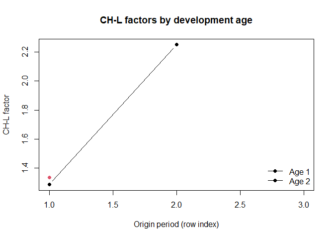

<!-- README.md is generated from README.Rmd. Please edit that file -->

# vitopack

[](https://github.com/Ondrej-Vit/vitopack/actions/workflows/R-CMD-check.yaml)
[](https://ondrej-vit.github.io/vitopack/)

<!-- badges: end -->

Utilities for actuarial **run-off triangles** and **Chain-Ladder
(CH-L)** workflows: creation of triangles from long data,
cumulative/de-cumulative transforms, CH-L factors (link ratios),
averaged factors, products (ultimate multipliers) and simple
visualizations.

- Website: <https://ondrej-vit.github.io/vitopack/>
- Bug reports: <https://github.com/Ondrej-Vit/vitopack/issues>

## Installation

``` r
# install.packages("pak")
pak::pak("Ondrej-Vit/vitopack")
```

## Quick start

``` r
library(vitopack)
```

### 1) Build a triangle from long data

``` r
df <- data.frame(
  accident = c(1,1,1,2,2,3,1),
  dev      = c(1,2,3,1,2,1,1),
  value    = c(10,20,30,40,50,60,60)
)

tri <- create_triangle(df, "accident", "dev", "value")
tri
#>      [,1] [,2] [,3]
#> [1,]   70   20   30
#> [2,]   40   50   NA
#> [3,]   60   NA   NA
```

### 2) Cumulative / de-cumulative transforms

``` r
cum_tri   <- create_cumulative_triangle(tri)
decum_tri <- create_decumulative_triangle(cum_tri)

stopifnot(identical(tri, decum_tri))  # sanity check
cum_tri
#>      [,1] [,2] [,3]
#> [1,]   70   90  120
#> [2,]   40   90   NA
#> [3,]   60   NA   NA
```

### 3) Chain-Ladder factors (link ratios)

``` r
chl_triangle <- create_chl_coef_triangle(cum_tri)
chl_coefs    <- create_chl_coefs(cum_tri, chl_length = c("full", 2))
chl_coefs
#>          CH_L_lengths  0        1        2
#> 1 chain_ladder - full NA 1.636364 1.333333
#> 2    chain_ladder - 2 NA 1.636364 1.333333
```

### 4) Ultimate multipliers (products over ages)

``` r
# Take the "full" row from create_chl_coefs() and compute products
full_row <- chl_coefs[chl_coefs$CH_L_lengths == "chain_ladder - full", -1, drop = FALSE]
ultimate <- create_product_coefs(full_row, name = "Ultimate")
ultimate
#> [1] "Ultimate"         NA                 "1.33333333333333"
```

### 5) Naming & simple visualization

``` r
# Name rows/columns for readability
named <- triangle_namer(chl_triangle, claim_period_names = paste0("Y", seq_len(nrow(chl_triangle))))

# Minimal static visualization (friendly to GitHub/CRAN)
ages_to_plot <- c(2, 3)  # development ages (columns) to plot
matplot(
  x = seq_len(nrow(named)),
  y = cbind(named[, ages_to_plot[1]], named[, ages_to_plot[2]]),
  type = "b", pch = 19, lty = 1,
  xlab = "Origin period (row index)",
  ylab = "CH-L factor",
  main = "CH-L factors by development age",
  ylim = range(named[, ages_to_plot], na.rm = TRUE)
)
legend("bottomright",
       legend = paste("Age", ages_to_plot - 1),
       lty = 1, pch = 19, bty = "n")
```

<div class="figure">


<p class="caption">
Average CH-L factors by development age (toy example).
</p>

</div>

> For interactive Plotly charts, see: `create_chl_trg_visualization()`
> and `create_chl_trg_visualization_pvzp()`. In README, prefer static
> plots for GitHub rendering.

## Main functions

- **Triangle utilities:** `create_triangle()`,
  `create_cumulative_triangle()`, `create_decumulative_triangle()`,
  `triangle_namer()`, `diag_reader()`, `diag_writer()`, `diag_sums()`.
- **CH-L workflow:** `create_chl_coef_triangle()`, `create_chl_coefs()`,
  `create_avg_coefs()`, `create_product_coefs()`.
- **Visualization:** `create_chl_trg_visualization()`,
  `create_chl_trg_visualization_pvzp()`.

## Notes

- Conventions: diagonal numbering uses **1 = shortest**, **n = main**
  (documented in `diag_reader()`).
- Examples use toy data; real-world usage typically works with
  monthly/quarterly origin & development periods.

<!-- -->
